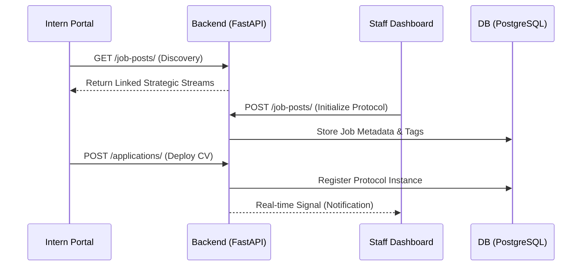

# [IMS] Intern Management System · Protocol v2.0

[](https://www.python.org/)
[](https://fastapi.tiangolo.com/)
[](https://reactjs.org/)
[](https://www.postgresql.org/)

**Institutional Recruitment & Strategic Stream Management.**
A high-fidelity, dual-portal ecosystem designed to automate and elevate the internship application lifecycle. Built for **LOOPLAB** recruitment streams.

---

## 🏛 System Architecture

The IMS operates on a synchronized protocol between the **Organizational Command Center** (Staff) and the **Intern Discovery Portal**.



---

## 🚀 Intentional Features

### 1. Semantic Tagging Engine
- **Color-Coded Badges**: Dynamic HSL generation ensures that categories like `AI Research` and `UX/UI Design` are visually distinct across the platform.
*   **Strategic Categorization**: HR can define custom tags (e.g., `Urgent`, `High-Growth`) that appear as neon-pills in the discover stream.

### 2. Immersive Discovery (Intern Portal)
- **Media-First Headers**: High-fidelity video and image banner support for every opening.
- **Strategic Occupancy**: Real-time monitoring of application capacity vs. available seats.
- **Mission Briefings**: Comprehensive popup modals detailing technical requirements and mission descriptions.

### 3. Application Ingestion (Staff Dashboard)
- **Automated CV Parsing**: Direct ingestion of applications via Mailgun inbound webhooks.
- **Operational Timeline**: Full audit logs for every applicant state change (New -> Selected/Rejected).
- **Communication Hub**: Pre-defined institutional email templates with variable substitution.

---

## 🛠 Strategic Deployment

### Prerequisites
- **Python 3.10+** (System Intelligence)
- **Node.js 18+** (Frontend Layer)
- **PostgreSQL** (Institutional Data Storage)

### 1. Infrastructure Setup
```bash
# Clone the repository
git clone https://github.com/looplab/ims-protocol.git
cd ims-protocol
```

### 2. Backend Initialization
```bash
cd backend
python -m venv .venv
.venv\Scripts\activate # Windows
# Install core dependencies
pip install -r requirements.txt
# Sync protocol schema
python add_tags_column.py
# Seed internal credentials
python seed_data.py
# Execute server
uvicorn app.main:app --reload
```

### 3. Frontend Deployment
```bash
cd frontend
npm install
npm run dev
```

---

## 🛡 Security & Governance
- **JWT Authorization**: Encrypted session management for all administrative roles.
- **Favicon Intelligence**: Dynamic icon switching based on active user role (Technical Cube for Staff, Paper Plane for Interns).
- **Media Isolation**: Secure storage of candidate CVs outside the public web root.

---

> [!IMPORTANT]
> **Default Admin Access**: `admin@looplab.io` / `password: admin123`
> **API Documentation**: [http://localhost:8000/docs](http://localhost:8000/docs)

Built with precision by **Antigravity** for **LOOPLAB**.
