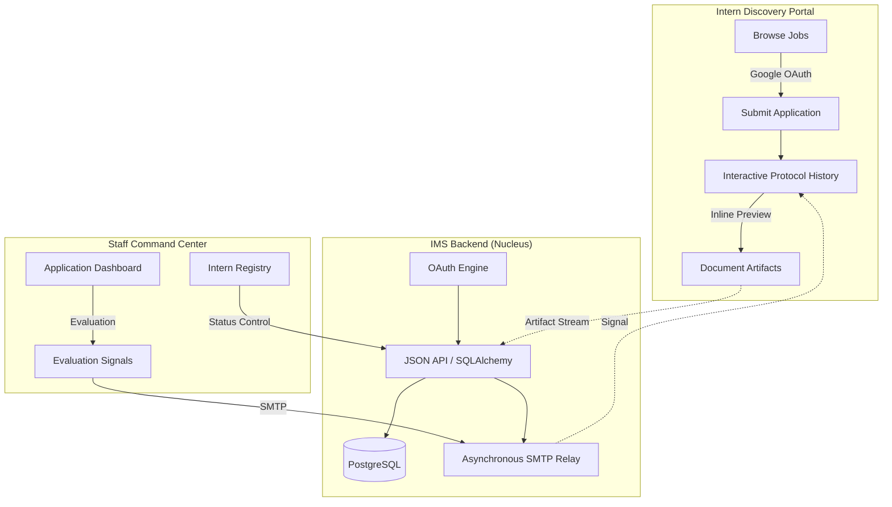

<div align="center">

# [IMS] Intern Management System · Protocol v3.0


[](https://www.python.org/)
[](https://fastapi.tiangolo.com/)
[](https://reactjs.org/)
[](https://www.postgresql.org/)

**Institutional Recruitment & Strategic Stream Management.**
A high-fidelity, dual-portal ecosystem designed to automate and elevate the internship application lifecycle. Built with precision for **LOOPLAB** recruitment streams.

[🚀 Discovery Portal](#-intern-discovery-portal) • [🏛 Command Center](#-staff-command-center) • [🛠 Setup Protocol](#-operational-setup-protocol)

</div>

---

## 🏛 System Architecture & Logic Flow

The IMS operates on a synchronized protocol between the **Organizational Command Center** (Staff) and the **Intern Discovery Portal**.



---

## 🚀 Mission Critical Feature Matrix

| Feature | Institutional Impact | Technology |
| :--- | :--- | :--- |
| **Identity Orchestration** | Dual-track security: **Google OAuth 2.0** for seamless intern onboarding and **2FA-protected** credentials for staff operations. | `PyOTP`, `python-jose` |
| **Protocol History** | High-fidelity interactive timeline for interns to track application state and preview submitted artifacts (CV/Resume) inline. | `iframe` + `Blob URLs` |
| **Semantic Tagging** | Modern HSL-based tagging engine that ensures categories like `AI Research` and `Engineering` are visually distinct. | `Tailwind` + `Vanilla CSS` |
| **Evaluative Signals** | Integrated communication bridge allowing HR to send official signals (Selected/Rejected) with automated SMTP alerts. | `aiosmtplib` + `Jinja2` |
| **Operational Registry** | Advanced master directory with state-based filtering (Active, Inactive, Incomplete) to monitor candidate lifecycle. | `React Hooks` + `SQLAlchemy` |

---

## 📂 Structural Blueprint

```text
ims-protocol/
├── backend/                # Core Command Logic (FastAPI)
│   ├── app/
│   │   ├── models/         # Institutional Database Schemas
│   │   ├── routes/         # Operational Operational Endpoints
│   │   ├── services/       # Business Logic & Infrastructure
│   │   └── schemas/        # Data Integrity Protocols (Pydantic)
│   ├── uploads/            # Encrypted Artifact Storage
│   └── scratch/            # Protocol Verification Scripts
├── frontend/               # User Interface Layer (React/Vite)
│   ├── src/
│   │   ├── pages/          # Full-Page Institutional Views
│   │   ├── components/     # High-Fidelity UI Modules (Glassmorphism)
│   │   └── context/        # Global Protocol State Management
└── README.md               # Strategic Documentation
```

---

## 🛠 Operational Setup Protocol

### Phase 1: Institutional Environment
Ensure your terminal meets the global recruitment standards: **Python 3.11+**, **Node.js 18+**, and a **PostgreSQL** instance.

### Phase 2: Nucleus Initialization (Backend)
```bash
cd backend
python -m venv .venv
# Activate Environment
.venv\Scripts\activate
# Install Core Command Modules
pip install -r requirements.txt
```

### Phase 3: Identity & Communication Config
Create a `.env` file in the `backend/` directory following this registry:
```ini
# Identity
SECRET_KEY=yoursecretkey
GOOGLE_CLIENT_ID=your-google-id
GOOGLE_CLIENT_SECRET=your-google-secret

# Communication (Gmail SMTP)
SMTP_HOST=smtp.gmail.com
SMTP_PORT=587
SMTP_USER=your-email@gmail.com
SMTP_PASSWORD=wxyo-gomr-uqnr-vbik  # Use Google App Password
FROM_EMAIL=your-email@gmail.com
```

### Phase 4: Server Ignition
```bash
# Execute Local Command Server:
uvicorn app.main:app --reload
```

---

## 🛡 Security & Governance

- **Protocol Isolation**: Candidate CVs and sensitive media are stored outside the public web root with strictly enforced access tokens.
- **Role-Aware Favicons**: Dynamic branding protocols (Technical Cube for Staff, Paper Plane for Interns).
- **Blob-Stream Previews**: Document artifacts are streamed as temporary blobs to prevent unauthorized caching and direct downloads during preview.

---

<div align="center">

### Built with precision for **LOOPLAB**. 
Managed by **Antigravity** Framework.

</div>
