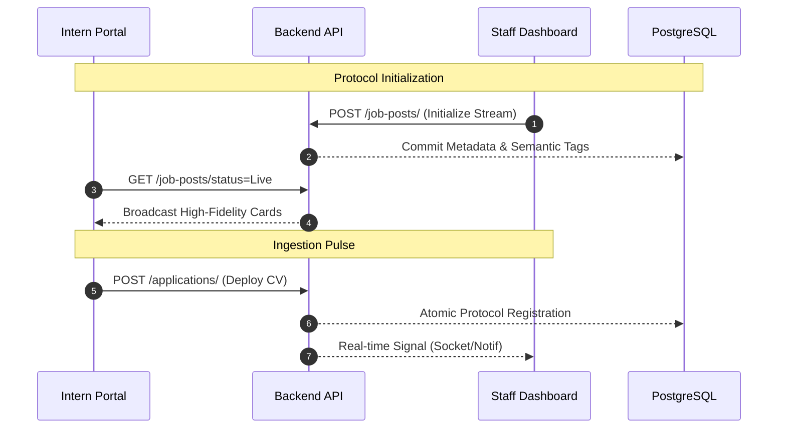

<div align="center">

# [IMS] Intern Management System · Protocol v2.0


[](https://www.python.org/)
[](https://fastapi.tiangolo.com/)
[](https://reactjs.org/)
[](https://www.postgresql.org/)

**Institutional Recruitment & Strategic Stream Management.**
A high-fidelity, dual-portal ecosystem designed to automate and elevate the internship application lifecycle. Built for **LOOPLAB** recruitment streams.

[🚀 Discovery Portal](#-discovery-portal) • [🏛 Command Center](#-command-center) • [🛠 Setup Protocol](#-setup-protocol)

</div>

---

## 🏛 System Architecture

The IMS operates on a synchronized protocol between the **Organizational Command Center** (Staff) and the **Intern Discovery Portal**.



---

## 🚀 Mission Critical Features

| 🛠 Core Engineering | 🎨 Discovery UI |
| :--- | :--- |
| **Semantic Tagging Engine**<br>Dynamic HSL generation ensures categories like `AI Research` and `UX/UI Design` are visually distinct with neon-pill branding. | **Media-First Recruitment**<br>Immersive 16:9 4K video and image banner support for every opening to maximize intern engagement. |
| **Automated Ingestion**<br>Direct CV and metadata ingestion via Mailgun inbound webhooks with intelligent duplicate detection. | **Strategic Occupancy**<br>Real-time "Seats Left" monitoring to create a professional sense of urgency and transparency. |

---

## 📂 File System Blueprint

```text
ims-protocol/
├── backend/                # Core Command Logic (FastAPI)
│   ├── app/
│   │   ├── models/         # Institutional Schema
│   │   ├── routes/         # Operational Endpoints
│   │   └── schemas/        # Data Integrity Protocols
│   └── uploads/            # Encrypted Media Stream
├── frontend/               # User Interface Layer (React/Vite)
│   ├── src/
│   │   ├── pages/          # Institutional Views
│   │   ├── components/     # Reusable UI Modules
│   │   └── services/       # API Communications
└── README.md               # Strategic Documentation
```

---

## 🛠 Operational Setup Protocol

> [!IMPORTANT]
> **Credential Registry**: Default Admin: `admin@looplab.io` / Password: `admin123`
> **API Documentation**: [http://localhost:8000/docs](http://localhost:8000/docs)

### Phase 1: Institutional Infrastructure
Ensure your environment meets the global standards: **Python 3.10+**, **Node.js 18+**, and **PostgreSQL**.

### Phase 2: Backend Deployment
```bash
cd backend
python -m venv .venv
# Windows Initialization:
.venv\Scripts\activate
# Install Core Modules:
pip install -r requirements.txt
# Sync Meta-Schema:
python add_tags_column.py
# Execute Local Server:
uvicorn app.main:app --reload
```

### Phase 3: Interface Initialization
```bash
cd frontend
npm install
npm run dev
```

---

## 🛡 Security & Governance
- **Protocol Isolation**: Candidate CVs and sensitive media are stored outside the public web root.
- **Role-Aware Favicons**: Dynamic branding (Technical Cube for Staff, Paper Plane for Interns).
- **JWT Authorization**: 256-bit encrypted session management for organizational roles.

---

<div align="center">
Built with precision by <b>Antigravity</b> for <b>LOOPLAB</b>.
</div>
